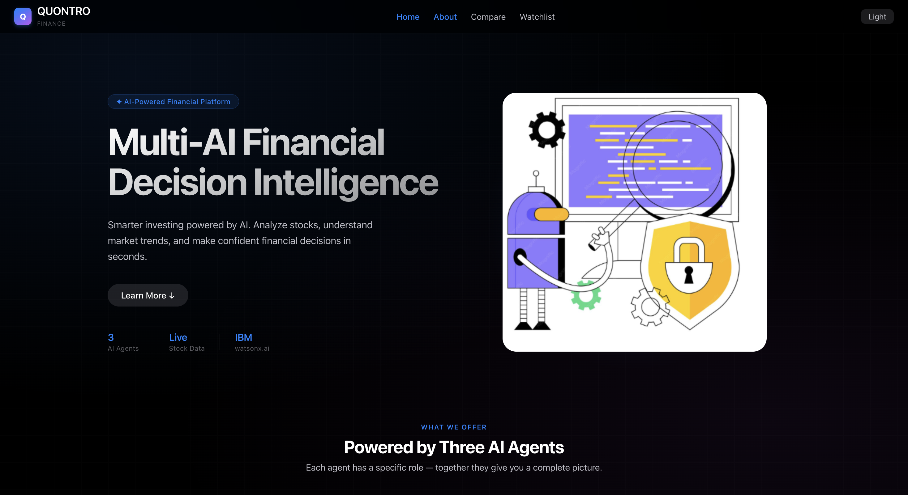
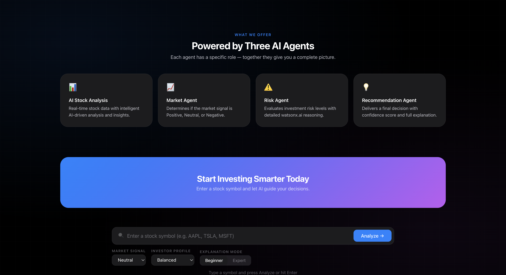

# Quontro

🚀 **Multi-AI Financial Decision Intelligence Platform**

Quontro is an AI-powered financial analysis platform developed as part of the **IBM SkillBuild Program**. The platform helps investors make smarter decisions by combining real-time stock analysis with specialized AI agents that evaluate market conditions, risk factors, and investment opportunities.

## 🌐 Live Demo

**Website:** http://quontro.vercel.app/

## 📖 Overview

Quontro leverages multiple AI agents working together to provide intelligent financial insights. Users can analyze stocks, compare investment opportunities, and build personalized watchlists with AI-powered recommendations.

## ✨ Key Features

### 📈 AI Stock Analysis
- Real-time stock analysis
- AI-generated investment insights
- Intelligent market evaluation
- Confidence-based recommendations

### 🤖 Multi-Agent Architecture
- **Market Agent** – Analyzes market trends and sentiment
- **Risk Agent** – Evaluates investment risk levels
- **Recommendation Agent** – Generates final investment decisions

### 📊 Stock Comparison
- Compare up to three stocks simultaneously
- Side-by-side analysis
- AI-powered comparison insights

### ⭐ Smart Watchlist
- Track favorite stocks
- Monitor investment opportunities
- Personalized AI recommendations

## 📸 Application Screenshots

### 🏠 Homepage



The main dashboard provides access to AI-powered stock analysis, real-time market insights, and financial decision support tools.

---

### 🤖 Multi-Agent Intelligence System



Quontro's core architecture is powered by three specialized AI agents that work together to deliver comprehensive investment recommendations and risk assessments.

## 🛠️ Technology Stack

### Frontend
- React.js
- JavaScript
- Tailwind CSS

### Backend
- Node.js
- Express.js

### AI & Analytics
- IBM watsonx.ai
- Multi-Agent Decision Framework

### Deployment
- Vercel

## 🚀 Getting Started

### Clone the Repository

```bash
git clone https://github.com/zeelthakkar02/Quontroo.git
cd Quontroo
```

### Install Dependencies

#### Frontend

```bash
cd frontend
npm install
npm run dev
```

#### Backend

```bash
cd backend
npm install
npm start
```

## 📂 Project Structure

```text
Quontroo/
├── frontend/
├── backend/
├── homepage.png
├── about.png
└── README.md
```

## 👥 Team

Developed collaboratively for the IBM SkillBuild Program.

## 🔗 Links

- **Live Demo:** http://quontro.vercel.app/
- **GitHub Repository:** https://github.com/zeelthakkar02/Quontroo

## 🎯 Future Enhancements

- Advanced portfolio management
- Real-time market alerts
- Historical trend analysis
- Personalized investor profiles
- Enhanced AI recommendation engine
- Mobile application support

## 📜 License

This project is intended for educational and demonstration purposes.

---

### IBM SkillBuild Project

Built as part of the IBM SkillBuild initiative to explore AI-powered financial decision-making and intelligent investment analysis using IBM watsonx.ai technologies.
